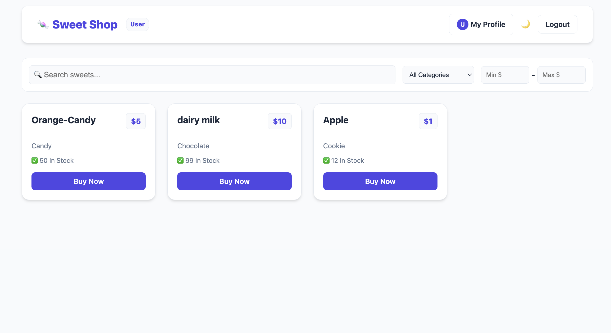
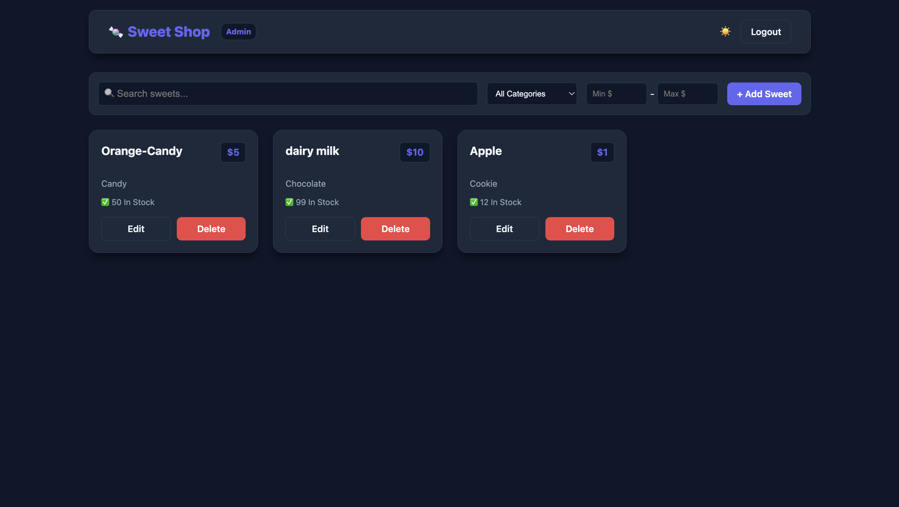
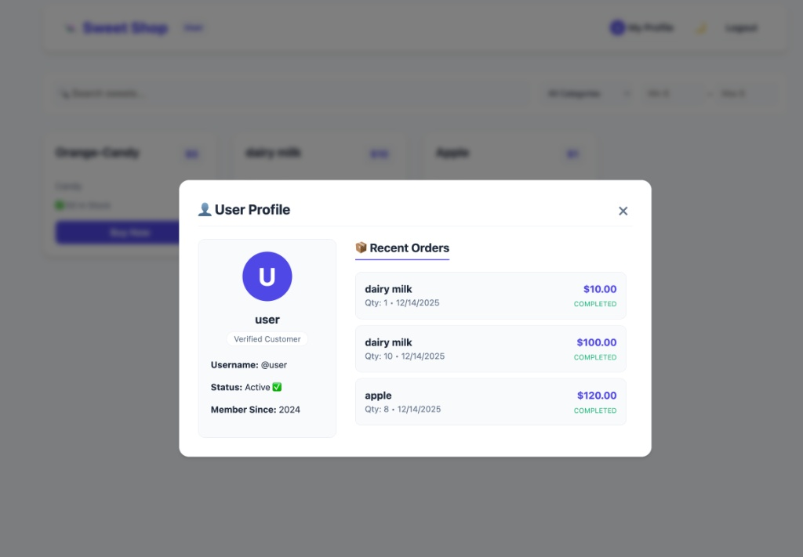
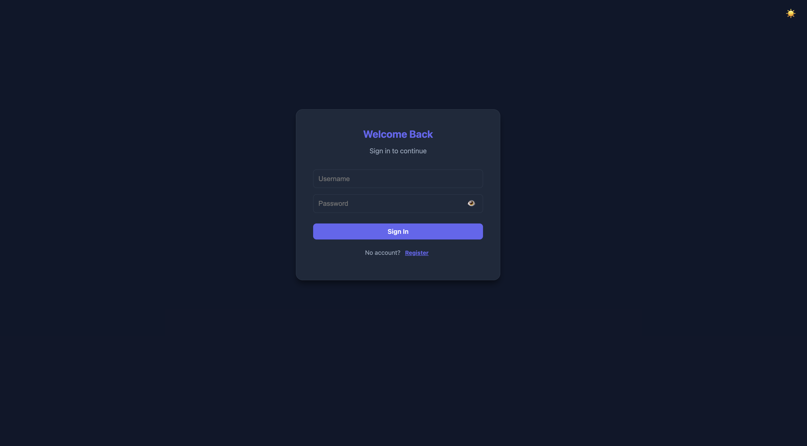

# 🍬 Sweet Shop

> A full-stack MERN application for managing a sweet inventory and processing orders, built with a strict **Test-Driven Development (TDD)** approach.

Sweet Shop is a robust and modern inventory management and e-commerce platform. It provides a seamless experience for customers to browse and purchase sweets while offering powerful tools for administrators to manage stock, categories, and track sales. The platform is built using the MERN stack (MongoDB, Express, React, Node.js) and features a sleek Glassmorphism UI.

## Table of Contents

- [Tech Stack](#tech-stack)
- [System Architecture](#system-architecture)
- [Key Features](#key-features)
- [Front-end](#front-end)
- [Back-end](#back-end)
- [TDD Approach](#tdd-approach)
- [API Design](#api-design)
- [Installation](#installation)

---

## Tech Stack

**Frontend**
- React (Vite)
- Axios
- CSS3 (Glassmorphism, CSS Variables)

**Backend**
- Node.js
- Express.js
- MongoDB + Mongoose
- JWT, Bcrypt

**Testing**
- Jest
- Supertest

**Tools**
- Git, Postman, Dotenv

---

## System Architecture

The Sweet Shop platform follows a classic client-server architecture:

- **Front-end**: Built with ReactJS (Vite), utilizing functional components and hooks for state management. It communicates with the backend via secure REST API calls using Axios.
- **Back-end**: Developed with Node.js and Express.js, handling business logic, authentication, and database operations.
- **Database**: MongoDB serves as the NoSQL database, storing user profiles, sweet inventory, and order history.

---

## Key Features

### 🎨 Modern User Experience
- **Glassmorphism UI**: A premium, translucent interface design.
- **Theme Support**: **Fully supported Light and Dark modes** that persist based on user preference.
- **Interactive Feedback**: Real-time validation, dynamic toast notifications, and confetti celebrations on successful purchases.

### 🛡️ Robust Security
- **Role-Based Access Control (RBAC)**: Strict separation between **Admin** (Inventory Management) and **User** (Shopping) roles.
- **JWT Authentication**: Secure, stateless authentication with Bcrypt password hashing.

### 📦 Inventory & Sales
- **Real-time Stock**: Automatic inventory deduction upon purchase.
- **Order History**: Detailed tracking of past purchases for users.

---

## Front-end

The front end is built with ReactJS and focuses on responsiveness and interactivity.

**For Customers:**
- **Browse & Filter**: Filter sweets by category (Chocolate, Cake, Candy, etc.) and price range.
- **Purchase Flow**: Intuitive "Buy Now" modals with quantity selection and total price calculation.
- **User Profile**: View personal details and a history of all past orders.
- **Visual Themes**: Toggle between Light ☀️ and Dark 🌙 modes.

**For Administrators:**
- **Dashboard**: Complete overview of all products with stock levels.
- **Inventory Management**: Add new sweets, edit existing details, or delete items.
- **Stock Monitoring**: Visual indicators for low or out-of-stock items.

**Tools Used**: ReactJS, CSS3 (Variables, Flexbox/Grid), Axios, Canvas Confetti.

### 📸 Screen Previews

| User Dashboard (Light) | Admin Dashboard (Dark) |
| :---: | :---: |
|  |  |

| User Profile Modal | Login Page |
| :---: | :---: |
|  |  |

---

## Back-end

The back end is robust, scalable, and tested.

- **Authentication**: JWT-based stateless auth. Middleware ensures protected routes are only accessible to authorized users.
- **Database Schema**: Mongoose models for `User`, `Sweet`, and `Order` ensure data integrity.
- **Business Logic**: Controllers handle complex logic like stock validation and transaction recording.

**Frameworks & Tools**: Node.js, Express.js, MongoDB, Mongoose, Dotenv, BcryptJS.

### Data Models
- **User**: Stores username, password (hashed), and role (`admin` or `user`).
- **Sweet**: Stores name, price, category, quantity, and description.
- **Order**: Links users to purchased sweets, recording quantity, price, and timestamp.

---

## TDD Approach

This project is unique because it was built using **Test-Driven Development**.

1.  **🔴 RED**: We wrote failing integration tests first (e.g., `should not allow user to add sweet`).
2.  **🟢 GREEN**: We implemented the minimal code to pass these tests.
3.  **🔵 REFACTOR**: We optimized the code for better performance and readability.

**Testing Stack**: `Jest`, `Supertest`, `Cross-Env`.

To verify the system integrity:
```bash
cd backend
npm test
```

## API Design

The Sweet Shop API follows RESTful principles, using standard HTTP methods and JSON for data exchange.

### Auth Endpoints
- `POST /api/auth/register`: Register a new user or admin.
- `POST /api/auth/login`: Authenticate user and receive a JWT token.

### Sweets Endpoints
- `GET /api/sweets`: Fetch all sweets. Supports query parameters for filtering:
  - `?category=Chocolate`: Filter by category.
  - `?minPrice=5&maxPrice=20`: Filter by price range.
  - `?search=candy`: Search by name.
- `POST /api/sweets`: **(Admin Only)** Add a new sweet to inventory.
- `PUT /api/sweets/:id`: **(Admin Only)** Update an existing sweet's details.
- `DELETE /api/sweets/:id`: **(Admin Only)** Delete a sweet from the database.

### Order Endpoints
- `POST /api/sweets/:id/purchase`: **(User)** Purchase a specific sweet. Requires `qty` in the body.
- `GET /api/sweets/myorders`: **(User)** Fetch the logged-in user's purchase history.

---

## Installation

Follow these steps to set up the project locally.

### Prerequisites
- Node.js (v14 or higher)
- MongoDB (Installed locally or using MongoDB Atlas)
- Git

### 1. Clone the Repository
```bash
git clone [https://github.com/HarshiLMalani07/SweetShop.git](https://github.com/HarshiLMalani07/SweetShop.git)
cd SweetShop
```

### 2. Backend Setup
Navigate to the backend folder and install dependencies.
```Bash
cd backend
npm install
```

Create a .env file in the backend directory with the following credentials:

Code snippet
```
PORT=3000
MONGO_URI=mongodb://127.0.0.1:27017/sweetshop
JWT_SECRET=your_super_secret_key
Start the backend server:
```

```Bash
npm run dev
```

### 3. Frontend Setup
Open a new terminal window, navigate to the frontend folder, and install dependencies.

```Bash
cd frontend
npm install
Start the React development server:
```
```Bash
npm run dev
```

---

### 👤 Author

**Harshil Malani**
* *Full Stack Developer & Competitive Programmer*
* [GitHub Profile](https://github.com/HarshiLMalani07)

---

<p align="center">
  <i>Made with 💙 by Harshil</i>
</p>